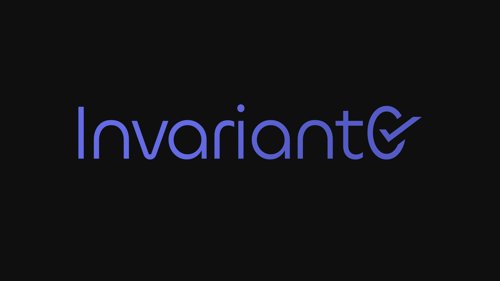

# Programmable Tokens by Invariant0

Welcome to Programmable Tokens research by [Invariant0](https://invariant0.com/), the Fresh New Face of Vacuumlabs Auditing.

It is a design research on how to bring programmable on-transfer functionalities to Cardano native tokens. We believe this will help bring exciting new functionalities to Cardano.

  
  

  

## Files

* Design [whitepaper](./whitepaper.pdf).
* Proof of Concept [files](./proof-of-concept/).

## Feedback

You can ask questions, share your ideas and discuss anything (not only) programmable tokens' related or just share your thoughts and feedback with us at info@invariant0.com.

## Changelog

This project is ever evolving. Please refer to the [Changelog](./CHANGELOG.md) to see the changes over time.

## License

Licensed under GPL-3.0. Full license text can be found [here](./LICENSE).
